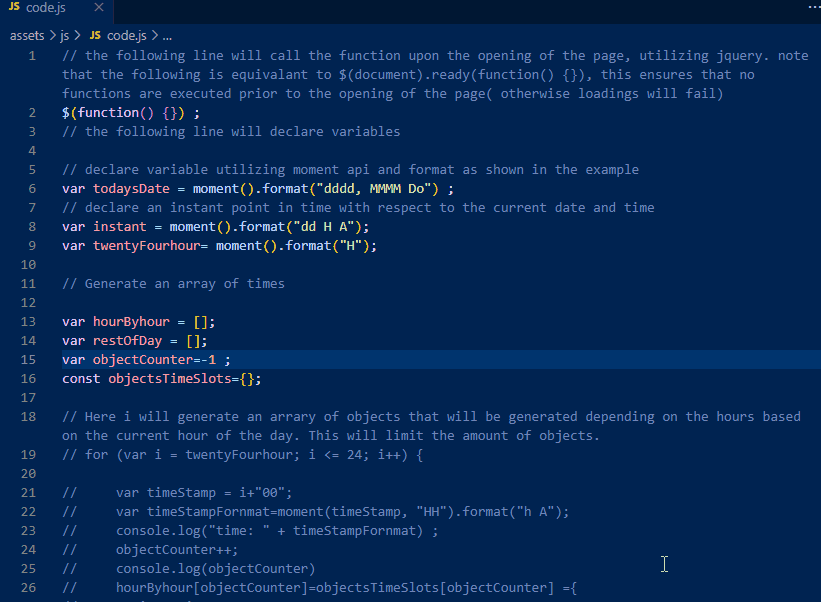
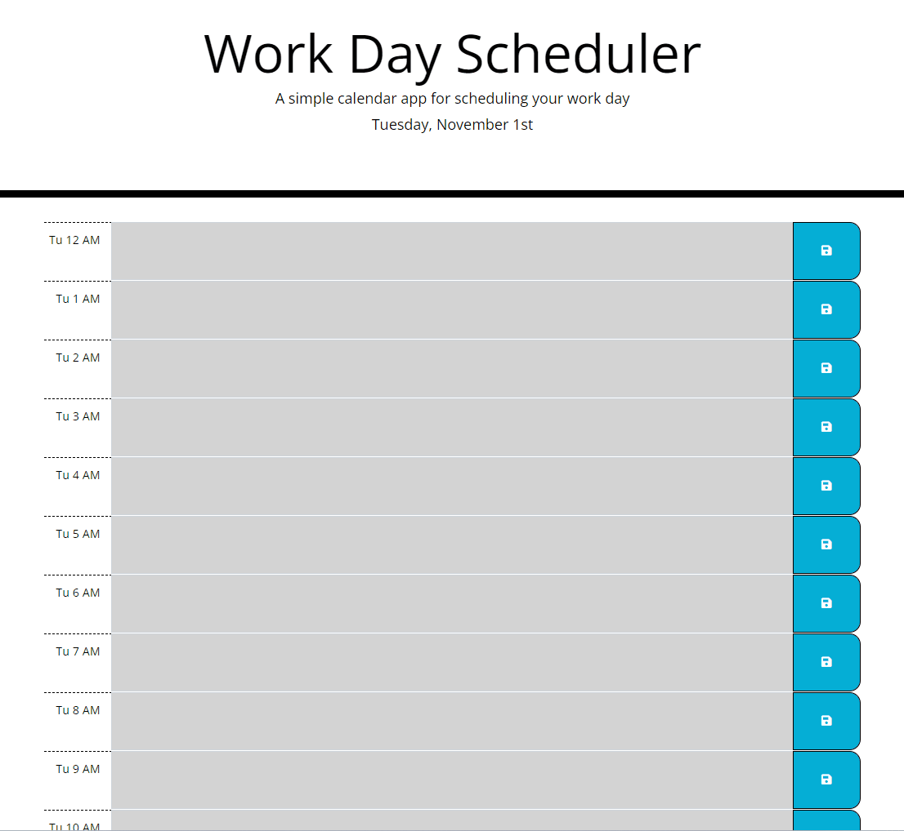

# Work Day Scheduler

### Description
Calender that is utilized for a 24 hour work day.
 

## How to use.

Open the webpage and the local storage will be utilized with input data.

The Gray background color will show times that have already passed.
The Red background color will show present time.
The Green background color will show future times.

 
 
*Link to Work Day Scheduler*  
[Work Day Scheduler](https://fondofhats.github.io/workday-scheduler/)
 
 
### Screenshot

 
### WebPage

 

## Technologies

* [HTML5](https://developer.mozilla.org/en-US/docs/Web/Guide/HTML/HTML5)
* [CSS](https://developer.mozilla.org/en-US/docs/Web/CSS)
* [Javascript](https://developer.mozilla.org/en-US/docs/Web/JavaScript)
* [jQuery](https://jquery.com/)
* [Font Awesome](https://fontawesome.com/)
* [Bootstrap](https://getbootstrap.com/)
* [Google Fonts](https://fonts.google.com/)